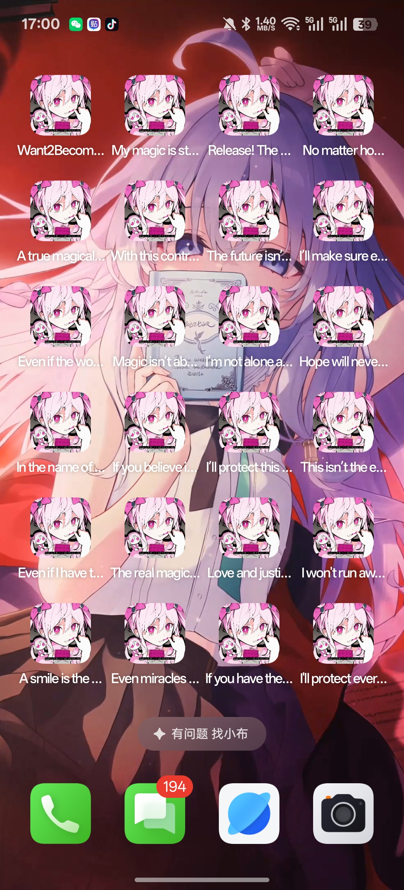

WMCTF2025 的安卓 Reverse出题笔记，你也想成为魔法少女吗?
<!--more-->
作为本次 `WMCTF2025` 的 `Reverse` 题目之一，因为害怕定位难做的人不多，我把此题目定位在mid难度（其实是我也不太确定难度捏，因为看懂了会很简单），直到比赛结束前的凌晨2点才出现了本题的唯一解（十分感谢这位师傅），解数也算是预料之中吧，不过居然成了本次解最少的Re题，我还是十分惭愧的。题目设计花了点时间导致ddl前没有写一篇详细的WP我十分抱歉，特此国庆回来写下这篇出题笔记，希望能对感兴趣的师傅有些许帮助，如果有不足之处还请师傅们在评论补充,十分感谢。
### 彩蛋部分
本次题目设计了一个小彩蛋，做题的师傅们有没有发现了吗？Apk安装后就会出现一整个桌面的魔法少女图标并且有不同的语录，不管点哪一个图标都是可以进入到题目页面的，通过任何一个图标卸载程序全部图标都会消失。

多图标只要在声明 activity 的时候为每个 activity 加上以下标签就行了
```xml
            <intent-filter>
                <action android:name="android.intent.action.MAIN"/>
                <category android:name="android.intent.category.LAUNCHER"/>
            </intent-filter>
```
比如
```xml 

        <activity
            android:theme="@style/LaunchTheme"
            android:label="Want2BecomeMagicalGirl"
            android:icon="@drawable/magical_girl"
            android:name="work.pangbai.magic.magical_girl.MainActivity"
            android:exported="true"
            android:launchMode="singleTop"
            android:configChanges="fontScale|layoutDirection|density|smallestScreenSize|screenSize|uiMode|screenLayout|orientation|keyboardHidden|keyboard|locale"
            android:windowSoftInputMode="adjustResize"
            android:hardwareAccelerated="true">
            <meta-data
                android:name="io.flutter.embedding.android.NormalTheme"
                android:resource="@style/NormalTheme"/>
            <intent-filter>
                <action android:name="android.intent.action.MAIN"/>
                <category android:name="android.intent.category.LAUNCHER"/>
            </intent-filter>
        </activity>
        <activity
            android:label="My magic is stronger than your darkness!"
            android:icon="@drawable/magical_girl"
            android:name="work.pangbai.magic.magical_girl.MainActivity1"
            android:exported="true">
            <intent-filter>
                <action android:name="android.intent.action.MAIN"/>
                <category android:name="android.intent.category.LAUNCHER"/>
            </intent-filter>
        </activity>
        <activity
            android:label="In the name of the Moon, I&apos;ll punish you!"
            android:icon="@drawable/magical_girl"
            android:name="work.pangbai.magic.magical_girl.MainActivity2"
            android:exported="true">
            <intent-filter>
                <action android:name="android.intent.action.MAIN"/>
                <category android:name="android.intent.category.LAUNCHER"/>
            </intent-filter>
        </activity>
        <activity
            android:label="Love and justice! Pretty sailor-suited soldier, Sailor Moon!"
            android:icon="@drawable/magical_girl"
            android:name="work.pangbai.magic.magical_girl.MainActivity3"
            android:exported="true">
            <intent-filter>
                <action android:name="android.intent.action.MAIN"/>
                <category android:name="android.intent.category.LAUNCHER"/>
            </intent-filter>
        </activity>
```
非主 Activity 的每个 Activity 申明一个类不写任何实现，就像这样
```java
package work.pangbai.magic.magical_girl;


public class MainActivity1 extends MainActivity {
}
```
再复制几个 Activity 之后不管点击哪个图标调转都会是第一个MainActivity，这样就实现了多图标的效果，十分有趣。
### 题目架构
题目使用`flutter + native + Java`实现，多少有点花哨但是流程还是很清晰的： `Flutter输入->加载libnative.so->修改字节码->判断libart.so指定位置有没有被修改->魔改aes加密->魔改Java加密->Flutter判断密文`，,整个程序只涉及到AES和XXTEA加密，其实最核心的部分是对 `Java` 层代码的魔改。
### Flutter部分
第一部分在比赛进行的过程中就难倒了许多师傅，`Flutter` 框架写的题目在国内CTF比赛中不算常见，但是确实也出现过不少次了，比如NepCTF2025，NKCTF2024，NewStarCTF2024等等。
这里逆向用到了项目 [Blutter](https://github.com/worawit/blutter) 。
