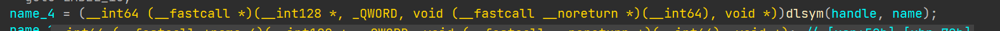
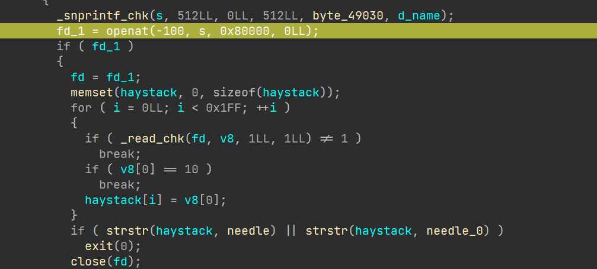

攻防世界总是在不断对抗，没有永恒的安全可言。
<!--more-->
Frida是安卓逆向分析的利器，注入检测一直是对抗的难题,学会解决这些问题才能成为一个真正的逆向工程师。
就原本的构建的frida而言，注入检测是十分简单的，从`/proc/self/maps`，从`/proc/self/stat`，都可以找到很多Frida注入特征。
社区开始想方设法屏蔽掉这些特征，比如patch源码，修改端口，但似乎都不能完全隐藏起来。
我个人日常使用的魔改Frida是[Florida](https://github.com/Ylarod/Florida/releases)，这里感谢一下作者，使用GitHub Action持续构建最新的release。
对于Frida的检查我决定分为两种比较好一种是利用`/proc`接口的检测，一种是运行时检测。
### 运行时检测
对于inline hook在工作时一定会修改汇编代码，crc快速校验text端是很有效的手段，但是会带来一定性能损失。
有没有更好的方法检测frida呢?有的。
Frida可以同时hook java和native代码，其中的java代码hook是通过hook libart 实现的,其中`art::ArtMethod::PrettyMethod`一定会被frida hook来使java hook正常工作。比起crc校验so的整个text段，不如直接crc校验`PrettyMethod`的函数前几个字节，可能有人会说，我怎么知道函数头原来的汇编是什么样的呢，我们其实可以把前几个字节保存到本地，然后每次启动一个线程去对比，如果数据不一致就说明被frida注入了（特别是用attach方式注入的），还有一种就是解析`PrettyMethod`汇编代码前几行，如果有  `b 0x*****`类型的长跳转也说明被frida注入了。 
还有一种运行时检测是堆栈检查，检查函数调用的堆栈信息,如果有异常情况也可以说明被hook了。
### /proc 接口的检测
基于/proc的检查被大厂app使用得更广泛，即使是魔改Frida也可以被检测出Frida特征，这里拿BiliBili app的libmsaoaidsec.so来说吧（不只是b站，这个so被非常多的app使用）。
这个so在加载时会调用`.init_proc`的初始化函数，其中一段代码动态解析libc获得pthread_create的地址,调用这个函数创建了三个线程，循环检测Frida特征，其中一个线程在遍历`/proc/self/task`，这个目录包含当前进程所有线程的运行信息，读取`/proc/self/task/tid/status`文件内容  内容包含线程名称，通过strstr判断线程名称是不是包含`gum-js-loop`和`gmain`来检测frida，检测成功就会闪退。

魔改特征的`Florida`并没有通过这一检测，同时不只是status，app还可以检`/proc/self/task/tid/stat` `/proc/self/task/tid/sched` `/proc/self/task/tid/comm`等多个目录下的文件内容,都可以检测出frida的信息。
最后还有个十分容易检测的特征是`/proc/self/net/unix`,被frida注入时会包含如下内容
```shell
0000000000000000: 00000003 00000000 00000000 0001 03 1741108 @/frida-e254654d-8ae6-4a50-9764-e54a961a9439
```
应该是frida用来远程通信的unix域套接字。
当然检测方法并不是这几种，也可以使用`/proc/self/maps`等其他方式进行检测,但是其他检测方案已经被魔改特征的`Florida`所隐藏了。 


检测方法很多，反检测方法其实也可以很多。
有补充或者勘误的小伙伴可以在评论区留言。
